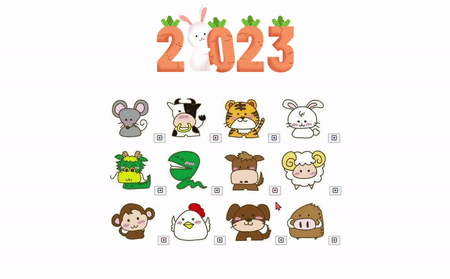

# 💡 **4주차 FE**

> [초보자를 위한 40가지의 자바스크립트 프로젝트](https://www.freecodecamp.org/korean/news/javascript-projects-for-beginners/#how-to-create-a-restaurant-menu-page)
>
> [바닐라 자바스크립트 프로젝트](https://www.youtube.com/watch?v=3PHXvlpOkf4&t=421s)
>
> `7. FAQ 페이지 만들기`

 

 

`이 프로젝트에서 다루는 주요 개념`

    document.querySelectorAll()
    addEventListener()
    forEach()
    classList.remove()
    classList.toggle()

> FAQ 페이지를 변형하여 `오늘의 운세` 페이지 제작

 

 

# 오늘의 운세 페이지 구현 화면

