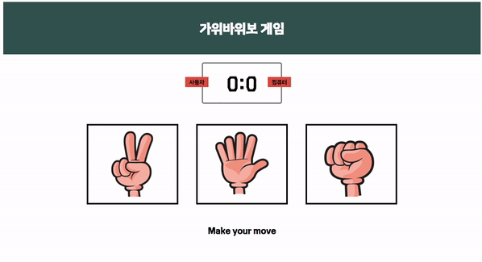

# 💡 **5주차 FE**

> [초보자를 위한 40가지의 자바스크립트 프로젝트](https://www.freecodecamp.org/korean/news/javascript-projects-for-beginners/#how-to-create-a-restaurant-menu-page)
>
> [바닐라 자바스크립트 프로젝트](https://www.youtube.com/watch?v=3PHXvlpOkf4&t=421s)
>
> `16. 가위바위보 게임 만들기`

 

 

`이 프로젝트에서 다루는 주요 개념`

    addEventListener()
    Math.floor()
    Math.random()
    switch문

 

 

## **`오류 해결`**

    1. Uncaught TypeError: Assignment to constant variable.

    const UserScore = 0; -> let UserScore = 0;
    
    const는 재할당을 허용하지 않는 변수이기에 값이 변할 수 있는 let으로 변경

 

 

## 가위바위보 게임 만들기 구현 화면

