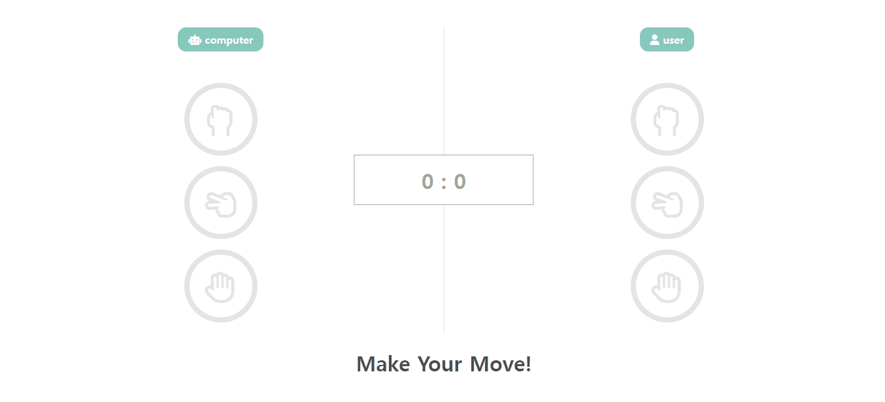

# ✔ 가위바위보 게임 만들기

computer와 user 간 가위바위보를 하는 게임을 만들었음
- user가 가위/바위/보 중 하나를 선택하면 computer도 하나를 선택하게 됨
- 승부가 판정 나면 승리 결과에 따라서 아래 텍스트가 뜨게 되고 색깔이 변하게 됨
  - 승자 ⇒ 초록색
  - 패자 ⇒ 빨간색
  - 무승부 ⇒ 노란색
- 게임 종료이 종료되면 더이상 가위/바위/보를 선택할 수 없게 되고 again 버튼과 reset 버튼 두 개가 뜨게 됨
  - again 버튼을 클릭하면 게임이 재시작됨
  - reset 버튼을 클릭하면 점수가 0으로 초기화된 후 게임이 재시작됨

## ▶ practice 1

> 튜토리얼 보기 전, 작성한 코드의 완성본

## ▶ practice 2

> 튜토리얼 본 후, practice 1 코드를 리팩토링한 결과 완성본

## 💡 후기

### 1) practice 1 vs practice 2

### 2) removeEventListener()

> 참고: [이벤트 제거 & 한번만 실행되게 하기](https://inpa.tistory.com/entry/JS-%F0%9F%93%9A-%EC%9D%B4%EB%B2%A4%ED%8A%B8-%EC%A0%9C%EA%B1%B0-%ED%95%9C%EB%B2%88%EB%A7%8C-%EC%8B%A4%ED%96%89%EB%90%98%EA%B2%8C-%ED%95%98%EA%B8%B0-removeEventListener-once)

'practice 1'에서 `endGame` 함수 작성 시, user가 더이상 가위/바위/보를 선택할 수 없고 호버했을 때도 스타일이 변하지 않게 코드를 작성해야 했다. 
이 기능을 구현하기 위해 가장 처음 떠올랐던 것은 해당 요소에 추가되어 있는 `addEventListener()` 이벤트 함수를 제거하는 방법이었다. 
즉, 가위/바위/보 각 요소에 등록된 'click', 'mouseover', 'mouseout' 이벤트 리스너를 제거해야했다.
추가된 이벤트 함수를 제거하기 위한 또다른 함수가 있지 않을까하는 생각에 구글링을 해보았고 위 참고 사이트를 통해 `removeEventListener()` 함수를 알게 되었다. 
`removeEventListener()`의 두번째 인자로 이벤트 콜백 함수가 들어가야하기 때문에, 이 함수를 사용해 기존에 등록된 이벤트 리스너를 제거하려면 `addEventListener()`의 콜백 함수로 익명 함수를 사용해서는 안된다고 한다. 
하지만 난 이미 `addEventListener()`의 콜백 함수로 익명 함수를 사용했고, 함수를 밖으로 빼 함수 표현식으로 함수를 선언을 하자니 'mouseover' 이벤트 리스너의 경우 코드가 너무 짧아서 비효율적이라는 생각이 들었다. 또한 'click', 'mouseover', 'mouseout' 이벤트 리스너 세 개를 모두 제거한 후, again이나 reset 버튼을 눌러 게임을 재시작할 때 세 개의 이벤트 다시 등록시켜야해서 비효율적인 코드가 될 것 같았다.
따라서 이벤트 리스너를 제거하는 방법 대신 `

`를 위에 덮어 가위/바위/보에는 어떠한 사용자 반응도 적용되지 않게 새로운 방법을 고안했고 성공적으로 구현했다. 