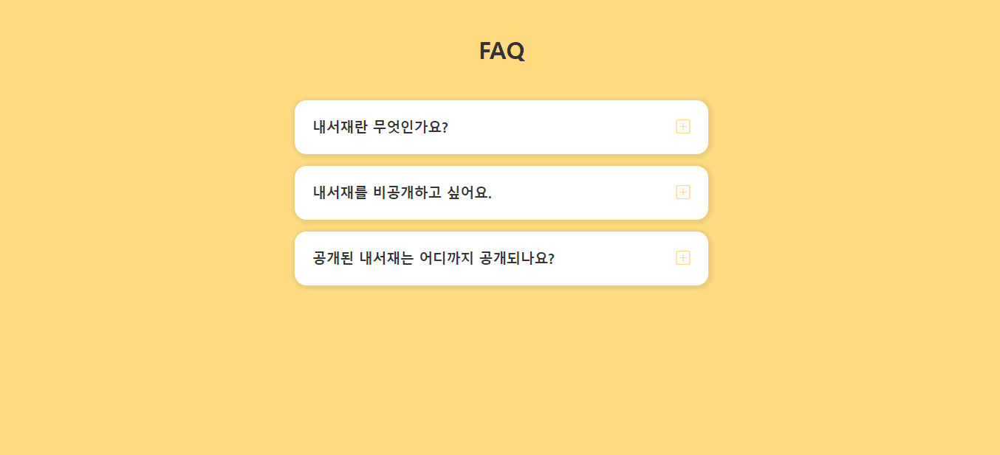

# ✔ FAQ 페이지 만들기

독서 플랫폼 [밀리의 서재]의 실제 FAQ 내용을 가져와 콘텐츠를 채워 넣었음

## ▶ practice 1

> 튜토리얼 보기 전, 작성한 코드의 완성본


## ▶ practice 2

> 튜토리얼 본 후, practice 1 코드를 리팩토링한 결과 완성본




## 💡 후기

### 1) practice 1 vs practice 2

> practice 1
1. button의 innerText를 js를 통해 직접 '+' ↔ '-' 변경
2. btn들을 순회하면서 클릭이벤트를 걸어줌
   - 클릭한button.부모요소.부모요소를 통해서 article의 클래스를 토글
3. 이외의 article들은 for ~ of문을 통해 순회하면서 클래스를 제거

> practice 2
1. button 내부에 plus/minus icon을 모두 넣어 둔 후, active한 article의 경우 plus icon은 `display:none`하고 minus icon은 `display:block`을 함
   - 즉, article의 클래스만 변경시키면 자동으로 button 내 icon의 모양도 변경됨
2. article을 순회하면서 각 article 내에 있는 btn에 클릭이벤트를 걸어줌
   - 이미 선언된 article 변수를 손쉽게 가져와 클래스 토글
3. 이외의 article들은 forEach()함수를 통해 순회하면서 클래스 제거


### 2) event.target vs event.currentTarget

> event.target
- 이벤트가 발생한 가장 안쪽의 요소
- 버블링이 진행되어도 변하지 않음

> event.currentTarget
- 핸들러가 실제 할당된 요소


### 3) parentElement vs parentNode

> node
- DOM 계층구조에 속한 모든 객체를 가리킴
- 내장 DOM element, HTML 특정 태그, 텍스트 노드, 주석 노드 등등

> element
- node의 특정한 하나의 타입
- HTML 특정 태그 등

> parentNode
- DOM 트리에서 특정한 노드의 부모 노드를 반환

  ```js
  console.log(html.parentNode)  // #document
  ```

> parentElement
- DOM 트리에서 특정한 노드의 부모 요소를 반환
- 부모가 없거나 부모가 DOM 요소가 아니라면 null을 반환
- 즉, parentElement의 반환값은 언제나 DOM 요소이거나 null

  ```js
  console.log(html.parentElement)  // null
  ```