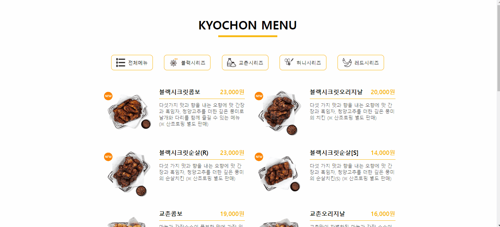

# ✔ 식당 메뉴판 만들기

교촌 치킨 사이트에서 실제 치킨 메뉴 데이터를 가져와 활용했음

## ▶ practice 1

> 튜토리얼 보기 전, 작성한 코드의 완성본

## ▶ practice 2

> 튜토리얼 본 후, practice 1 코드를 리팩토링한 결과 완성본

## 💡 후기

### 1) practice 1 vs practice 2

> practice 1
1. 첫 화면에는 '전체 메뉴'가 보이게 모든 메뉴 데이터를 DOM 추가할 때, 특별히 이벤트를 걸어주지 않음
2. for문을 사용해 각 메뉴 데이터를 순회
   - 직접 만든 addMenu()함수의 인자로 메뉴 데이터를 넣은 후 함수를 실행시킴
   - 함수는 메뉴 데이터를 html 태그에 담은 후 DOM 추가해줌
3. addMenu()함수
   - 하나의 메뉴 데이터를 인자로 받아 DOM에 하나씩 추가
4. 필터 버튼에 대한 태그는 html에 작성

> practice 2
1. 첫 화면에는 '전체 메뉴'가 보이게 모든 메뉴 데이터를 DOM 추가할 때, window 객체에 `DOMContentLoaded` 이벤트를 걸어줬음
2. map() 메서드를 사용해 각 메뉴 데이터를 순회
   - map() 함수 내부에 직접 만든 특정 함수의 인자로 메뉴 데이터를 넣음
   - 함수는 메뉴 데이터를 html 태그에 담은 후 반환해줌
   - 결과적으로 map() 함수는 각 메뉴의 데이터를 html 태그에 담아 배열 형태로 반환해줌
   - 이후 join() 메서드를 사용해 각 메뉴 article을 하나로 합친 후 DOM 추가해줌
3. displayMenuItems()함수
   - 여러 개의 메뉴 데이터들을 인자로 받아 DOM에 한번에 추가
4. 필터 버튼도 js를 통해 DOM 추가
   - 새로운 카테고리를 가진 메뉴 데이터가 생기면 바로 반영됨