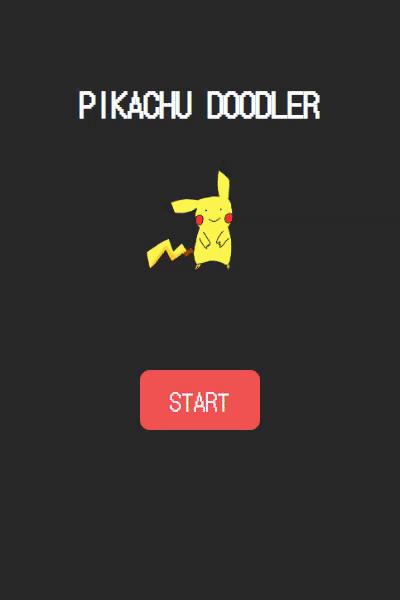

# Doodle Jump



<br>

### 19. [두들 점프 만들기](https://www.freecodecamp.org/korean/news/javascript-projects-for-beginners#how-to-create-doodle-jump-and-flappy-bird)

<br>

- `createElement()`

  - 요소를 만드는 함수

- `forEach()`

  - 주어진 함수를 배열 요소 각각에 대해 실행

  - ```js
    const array1 = ['a', 'b', 'c'];
    
    array1.forEach(element => console.log(element));
    
    // expected output: "a"
    // expected output: "b"
    // expected output: "c"
    ```

- `setInterval(콜백함수, 시간)`

  - 시간마다 콜백함수를 반복해서 실행(시간 단위는 ms)

- `clearInterval(변수)`

  - 변수의 반복을 중단

- `removeChild()`

  - 자식 요소를 제거

- `appendChild()`

  - 부모 요소에 자식 요소를 마지막 자식으로 추가

- `addEventListener()`

  - 요소에 대한 이벤트 함수 생성

- `removeEventListener()`

  - 요소에 대한 이벤트 함수 제거
