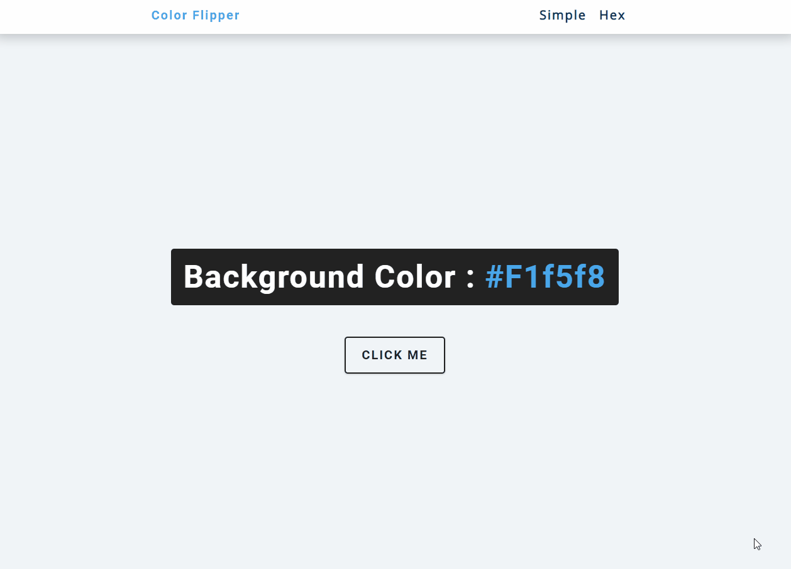

# Color Flipper 만들기

> 랜덤으로 배경색을 바꿀 수 있는 Color Flipper

DOM을 공부해야 하는 이유에 대한 [Leonardo Maldonado의 글](https://www.freecodecamp.org/news/whats-the-document-object-model-and-why-you-should-know-how-to-use-it-1a2d0bc5429d/#:~:text=Advantages,the page without a refresh.)에서의 설명 : 

> DOM을 다루는 방법을 알게 되는 순간 무한한 가능성이 열립니다. 새로고침을 하지 않아도 페이지에서 데이터를 업데이트해 주는 애플리케이션을 만들 수 있습니다. 사용자가 커스터마이즈 할 수 있는 애플리케이션을 만들 수도 있고, 새로고침 없이 페이지의 레이아웃을 변경할 수도 있습니다.

- 본 프로젝트에서의 주요 개념

  - arrays

  - document.getElementById()

  - document.querySelector()

  - addEventListener()

  - document.body.style.backgroundColor

  - Math.floor()

  - Math.random()

  - array.length
