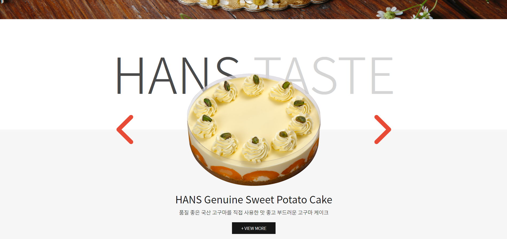

# 한스케이크 웹사이트 클론코딩

- 기간 : 2023.01.02 - 2023.01.07

<video src="../../../../Downloads/Animation1.mov"></video>

> - 아직 미완인 기능
>   - 네브바 드롭다운 메뉴
>   - 캐러셀, 슬라이드가 완벽하지는 않고 오류가 있음
>     - 캐러셀 오류
>       - text overflow hidden
>       - 마지막 슬라이드에서 다시 첫 번째 슬라이드로 이동할 때의 애니메이션
>     - 슬라이드 오류
>       - 애니메이션이 완벽히 똑같지 않음
>     - 캐러셀, 슬라이드 공통 오류
>       - manual navigation을 사용 가능하지만, 자동재생의 순서를 계속해서 따름
>       - 예시 ) 슬라이드 3을 누르면 해당 슬라이드로 이동하지만, 슬라이드 2가 자동재생 될 순서일 경우 슬라이드 2로 곧바로 넘어감

[한스케이크 웹사이트](http://www.hanscake.co.kr/)